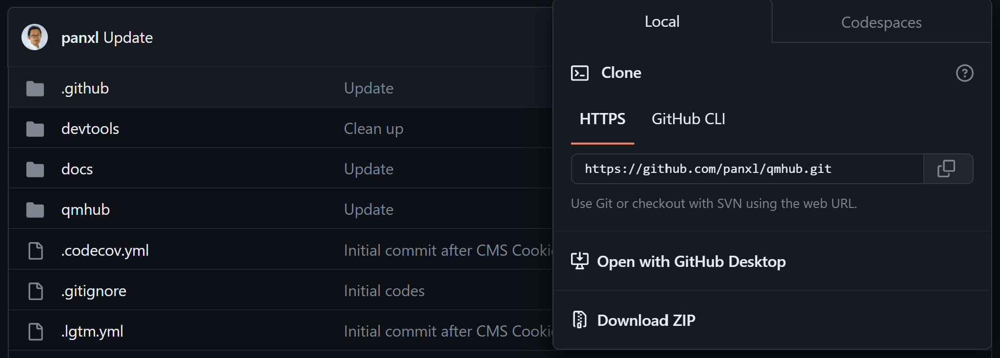
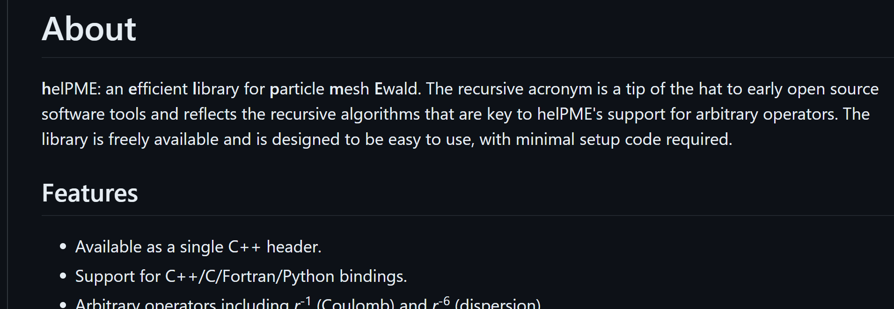

Installation
============

install mambaforge or miniforge
install numpy, scipy, and ipython

.. code-block:: console
    git clone https://github.com/panxl/qmhub.git
    pip install numpy, scipy, ipython

you should now have seperate directroy with qmhub.ini, qmmm.inp, and qmmm.out
you run qmhub in this directory
.. code-block::
    qmhub -t qmmm.inp qmhub.ini

  
Outside of this directory, run the following commands:
.. code-block::
    git clone https://github.com/andysim/helpme.git
    cd helpme
    module load CMake/3.9.6
    mkdir build
    cp cmake.sh build
    cd build
    bash cmake.sh
    make helpmelib
    cp python/helpmelib.cpython-310-x86_64-linux-gnu.so /[pwd]/mambaforge/lib/[python.version]/site-packages/qmhub

N.B. you have your own cmake.sh for your server enviorment, for example:
.. code-block::
    CXX=icpc PKG_CONFIG_PATH=~/mambaforge/lib/pkgconfig cmake .. -DFFTW_INCLUDES=$MKLROOT/include/fftw -DFFTW_LIBRARIES=$MKLROOT/lib/intel64 -DHAVE_FFTWF=1 -DHAVE_FFTWD=1 -DHAVE_FFTWL=1 

if you use an intel compilers, you will need to compile each time at the start of the session; run:
..code-block::
    module load intel/2020a
    export LD_PRELOAD=$MKLROOT/lib/intel64/libmkl_core.so:$MKLROOT/lib/intel64/libmkl_sequential.so

If errors are encountered, see: https://stackoverflow.com/questions/61341878/intel-mkl-fatal-error-when-running-kaldi-gst-live-demo

Command Line Usage
------------------

Generate the .inp input file manually
use mdanaylsis, a script with pdb, or anything that can generate data in right format	
https://docs.mdanalysis.org/stable/index.html

qmmm.inp contains:

    first 3 columns xyz cordiantes
    
    4th column is charge for MM
    
    5th column is atomic number for QM

run:
.. code-block::
    qmhub -t qmmm.inp qmhub.ini

View the output in qmmm.out as a coordinate list

N.B. in qmmm.ini, nrespa is the number of MM cycles between QM cycles

Python Module
-------------

qmhub can be used as a python moduele that can do all and more of qmhub commandline functionality:

    take arrays from .nc and .psf formate and copy them directly into QMhub with pdb, mdanaylsis, anything

    force matching
    
    Maxmimum likelihood potentional training

    energy weighting
        
        by using python to extract the desired array from qmhub and do maniputations or seperate from simulations
